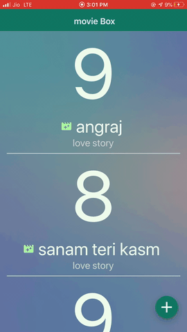

# movie box 

movie box app is used to note-down movies, with there rating and category 
add movies manually with name of movie and about the movie.
all movies will show on the home screen after added click any movie title to view  further information 

                 

## features
- stack navigation
- react state
- form input 
- validation of form
- star rating 
- keyboard avoiding view 
- floating add button 

### Tech

Dillinger uses a number of open source projects to work properly:

* [node.js] - evented I/O for the backend
* [react native] - cross platform app environment !
* [git] - git CMD to installs dependencies
* [material Icons] - all kind of icons 
* [visual studio code ] - awesome text editor by Microsoft
 
## 📋 Requirements

React Native apps may target iOS 10.0 and Android 4.1 (API 16) or newer. You may use Windows, macOS, or Linux as your development operating system, though building and running iOS  emulator apps is limited to macOS. Tools like [Expo](https://expo.io) can be used to work around this.
